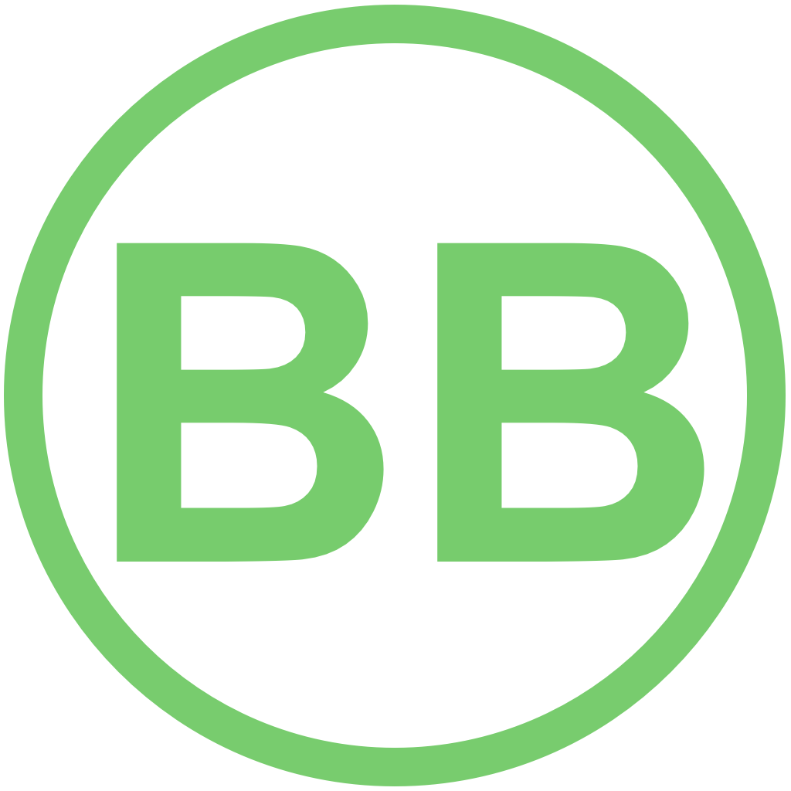

# 欢迎来到 Betterlife 框架

* [下载地址](https://github.com/skygreen2001/betterlife)

支持IT开发者快速开发、易于维护、实用于项目和产品开发的框架，它的原则通用于Php、Java、C#；集成通用的增删改查导入导出模式、提供了一对一、一对多、多对多关系表示层的通用实现；

这一切都可以用一键生成所有的代码，在初期能快速开发，后期易于修改维护不断完善成为产品；它不只是代码级框架的实践，也是项目经验的实践。它不只生成代码，还自动生成项目所需的文档。

使用本框架需遵循实用原则，应根据项目实际使用场景中必须开发的功能进行框架工具的使用，框架更多的高级功能更推荐在学习中练习使用；

如不能熟练使用框架的高级功能，建议只使用框架核心的功能进行项目的快速开发即可；即在便捷的使用框架提供的各种工具类和规范代码行为之外，尽量使用php原生的方式进行开发；php本身已经是一个很棒的框架语言设计；

**框架核心很小，不到3M**

框架核心不只适用于web开发，它也适用于微信、移动web开发、它很小、更快、更易维护;一天开发一个微信网站、移动web开发并非天方夜谭。

定制界面要求采用项目重用类型为［精简版］,［精简版］的工程重用生成您的工程基础，它的Web后台[admin]是采用常规的Web开发模式html+css+[jquery + javascript]实现。

目前该模式已完成主体开发，现在正进行高级功能的完善。

将和开源框架betterlife.front整合，即适合不同的前端框架，包括Vuejs、React、Angular、Uni-app、小程序框架如iView weapp、Vant Weapp、Chameleon、wepy、taro、mpvue等，betterlife因前端框架变化而千变万化。

## 帮助文档

  * [学习手册](https://skygreen2001.github.io)

## 新手上路

  * [新手上路](../quickstart/README.md)

## 下载源码

  * [下载地址](https://github.com/skygreen2001/betterlife)

## 体验框架

- 如果使用 Wamp ｜ Lamp ｜ Mamp | ampps | Xampp 运行该框架,它会被放置在www目录下

- 访问框架根路径地址: http://127.0.0.1/betterlife

- 可访问

  * 网站前台
  * 管理后台
  * 报表系统
  * 手机应用
  * 通用模版

- 框架以博客网站为原型创建了网站前台和后台,并以其为载体设想一个网站从开发初期到运维整个项目开发过程;

- 基于快速开发、易于学习、易于重用的原则构建了框架核心及其工具集；

- 并在开发项目的实战中不断加以淬炼、优化、调整。

- 通用模版是基于数据库作为源头；建立在以表为单位、以标准的增删改查、分页操作为积木搭建项目的大厦；

- 网站前台和管理后台可以作为观察实际场景中框架的运用示例，可作为真实项目前后台构建的文件目录基础结构；

- 而通用模版则可以作为开发真实项目中开发的第一步，其中的代码在生成后可以直接重用作为每一个页面服务端动态代码;

- 剩下的工作只是基于不同的用户构建用户体验良好的界面；而在开发主体功能结束后，再针对性能瓶颈点进行性能调优，项目可成也!

## 设计开发路线

* 数据库原型设计  : MysqlWorkbench
* 代码原型       : betterlife框架的代码生成工具
* 页面原型设计    : Axure[推荐]
* 设计图到静态页面 : Html5 + Css3 + Javascript
* 部署工具       : 
                  Wamp(Windows) ｜ Mamp(Mac) ｜ Lamp(Linux) | XAMPP ｜ AMPPS
* 中间件服务器    : Apache｜nginx
* 开发语言       : Php
* 数据库         : Mysql

## 开发流程：

* 数据层：MysqlWorkBench->Mysql->Betterlife框架的代码生成工具->生成前端和后台代码

* 表示层：Photoshop -> 
         Visual Studio Code | Atom | Sublime | Brackets 
         -> 静态标准Html页面+Css+[Javascript + Jquery ]

* 逻辑层：整合数据层<=>表示层

## 框架目录定义

  - core   : 框架核心支持文件
  - taglib : 自定义标签，您也可以在自己的应用中定义自定义标签
  - install: 安装目录
  - misc   : 引用第三方Js、Css、Image、Fonts资源目录
  - tools  : 开发项目中通常用到的工具，包括项目重用工具、代码生成工具、消除整站文件BOM头工具、压力测试工具等
  - home   : 应用目录，Web应用层所有代码都放在这里，每一个Web应用是一个子目录。
             (每个应用目录名称需在Gc.php里的变量:$module_name里注册)

    - admin     : 后台管理
    - model     : 通用模版
    - report    : 报表系统
    - betterlife: 网站前台
  - api    : ajax请求服务端服务支持[手机或Web前端ajax请求返回json数据]
  - app    :

    - html5: 自适应html5Web网页[内嵌在手机App里]
    - redis: Redis系统数据监控工具
  - api    : ajax请求服务端服务支持[手机或Web前端ajax请求返回json数据]
  - log    : 日志目录，每天一个调试测试日志文件放在这里
  - upload : 后台上传文件(如图片、pdf)放置目录
  - docs   : 框架帮助说明文档

  - 重要的二级目录说明

    - core/config      : 配置文件[各个功能模块]
    - core/util        : 常用的工具类
    - core/include     : 常用的函数库
    - install/db       : 框架数据库测试数据
    - api/mobile       : 手机端ajax请求服务端返回json数据
    - api/web          : Pc端ajax请求服务端返回json数据
    - upload/images    : 上传图片放置路径
    - upload/attachment: 批量导入/导出数据文件(如excel)放置目录

## 一个重要的文件

- 全局变量定义配置文件: Gc.php

- 位置: 根路径下

- 在这里定义了整个框架都会使用的一些配置，以下会列举一些重要的变量说明，其它可在使用框架时再仔细查看这个文件。

    * $database_config 数据库定义配置
        具体定义如下
        * $host    : 数据库主机名,默认本地:127.0.0.1
        * $port    : 数据库端口,默认mysql端口:3306
        * $username: 数据库用户名
        * $password: 数据库密码
        * debug    : 记录日志:数据库sql查询语句

    * $appName      : 网站应用的名称
    * $appName_alias: 应用名的缩写
    * $dev_debug_on : 开发模式,是否打开Debug模式
    * $dev_php_debug_on: 是否开放php提供的debug信息

- 以下路径配置，框架会自动寻找到它们的路径，也可以直接手动定义其配置。

    * $url_base     : 网站根路径的URL路径
    * $nav_root_path: 网站根路径的物理路径
    * $upload_url   : 上传图片的网络路径
    * $upload_path  : 上传图片的路径
    * $attachment_path   : 上传或者下载文件的路径
    * $attachment_url    : 上传或者下载文件的网络路径
    * $nav_framework_path: 框架文件所在的路径

一般来讲，框架和项目所有的配置文件都会放置在根路径core/config目录下，例如代码生成的配置文件ConfigAutocode.php。

## 自动部署

网站在本地会显示默认欢迎页面,在页面上会提示引导进入前台、手机、通用模版、报表系统的入口、下方提示本框架最常用的四个工具:

  * 工程重用
  * 数据库说明书
  * 代码生成器(前期:前台、手机、通用模版代码生成)
  * 报表生成器(后期:报表代码生成)
  * 工具箱

## 本地访问模式

  - 本地访问模式支持127.0.0.1或者localhost访问，如果使用内网地址如192.168.1.110类似的格式则无效;可通过修改根路径下的Welcome.php文件调整识别本地访问

  - 在发布到服务器上，无需修改任何编码即可默认进入网站前台，它是项目真正用户的界面入口。

  - 如框架的域名为: http://betterlife.test

## 参考资料

  - [帮助说明文档](https://skygreen2001.github.io/betterlife.book/)
  - [帮助文档源码](https://github.com/skygreen2001/betterlife.book)
  - [PHP The Right Way](https://laravel-china.github.io/php-the-right-way/)
  - [学习与收集](../learn/README.md)
  - [VuePress制作本书官网](../ace/more/makeweb.md)
  - [本框架早期帮助文档](http://skygreen2001.gitbooks.io/betterlife-cms-framework/content/index.html)
